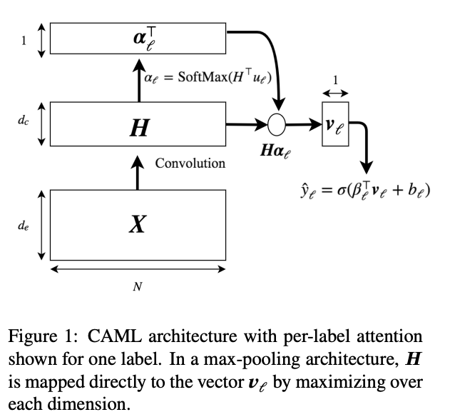
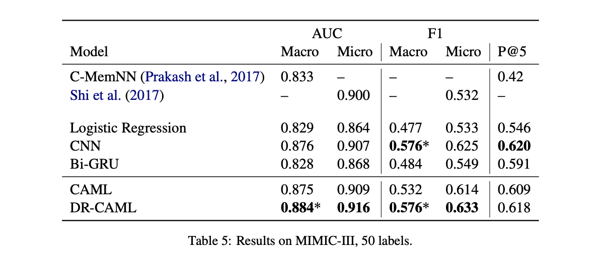
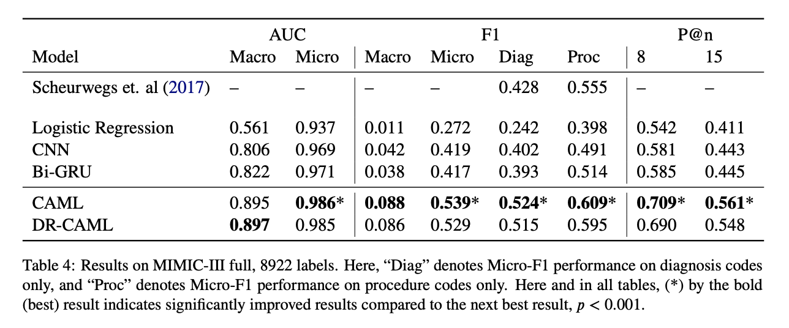

# CAML: Convolutional Attention for Multi-Label classification
> [Mullenbach, J., Wiegreffe, S., Duke, J., Sun, J., & Eisenstein, J. (2018). Explainable prediction of medical codes from clinical text. arXiv preprint arXiv:1802.05695.](https://arxiv.org/pdf/1802.05695.pdf)
> [jamesmullenbach/caml-mimic](https://github.com/jamesmullenbach/caml-mimic)

## Motivations
Manual coding is timeconsuming and error-prone, automatic coding can help.  
Challenges of ICD mdedical coding:
1. large label space (about 8k codes for ICD-9-CM)
    - over 15,000 codes in the ICD-9 taxonomy, 
    - over 140,000 codes combined in the newer ICD-10-CM and ICD-10-PCS taxonomies
2. clinical text is long and dirty
    - irrelevant information
    - misspellings 
    - abbreviations
    - medical vocabulary

Proposed solutions: Convolutional Attention for Multi-Label classification (CAML), motivated by the conjecture that important information correlated with a code’s presence may be contained in short snippets of text which could be anywhere in the document.

## Datasets
Medical code prediction tasks (ICD-9) using MIMIC-II and MIMIC-III datasets.  

### Pre-processing
1. remove tokens that contain no alphabetic characters (e.g., removing “500” but keeping “250mg”)
2. lowercase all tokens
3. replace tokens that appear in fewer than three times in training documents with an ‘UNK’ token.
4. pretrain word embeddings of size 100 using the word2vec-CBOW method (Mikolov et al., 2013) on the preprocessed text from all discharge summaries.
5. all documents are truncated to a maximum length of 2500 tokens.

### Several setups on MIMIC-II and MIMIC-III
1. MIMIC-III full
    - Full code prediction of MIMIC-III dataset
    - 8922 labels
2. MIMIC-III 50
    - For comparison with prior work, we also follow Shi et al. (2017) and train and evaluate on a label set consisting of the 50 most frequent labels
    - Resulting in 8,067 summaries for training, 1,574 for validation, and 1,730 for testing. (0.7094 : 0.1384 : 0.1521)
3. MIMIC-II full
    - Full code prediction of MIMIC-II dataset

## Methods
an attentional convolutional network that predicts medical codes from clinical text.

- the hyperparameters of the CAML model and the neural baselines are tuned using the Spearmint Bayesian optimization package (Snoek et al., 2012; Swersky et al., 2013)
- precision@8 on the MIMIC-III full-label validation set are used for the performance measure of hyper-parameters
- the learning rate are manually fine-tuned

## Results
The results of CAML can also be found on [papers-with-code/medical-code-prediction/mimic3](https://paperswithcode.com/sota/medical-code-prediction-on-mimic-iii?metric=Micro-F1)

## Parents
- [Shi et al. (2017): Shi, H., Xie, P., Hu, Z., Zhang, M., & Xing, E. P. (2017). Towards automated ICD coding using deep learning. arXiv preprint arXiv:1711.04075.](shi-etal-2017/README.md)

