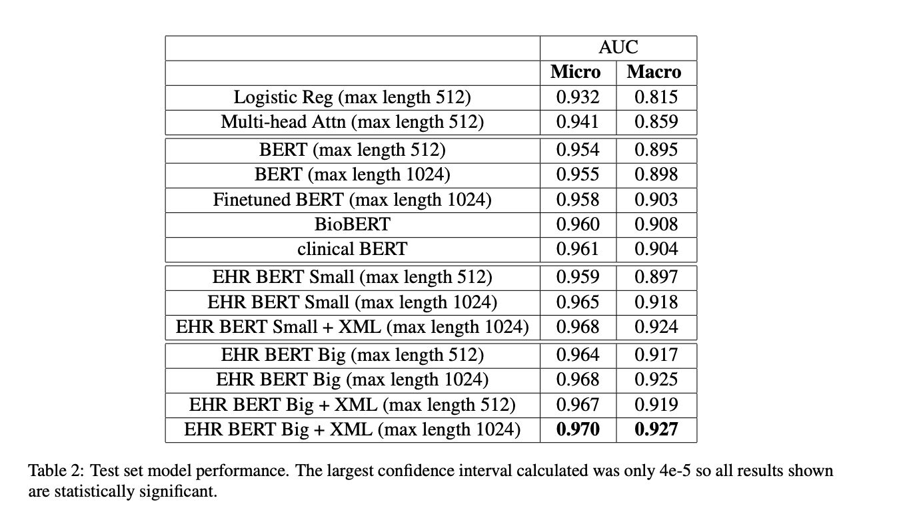
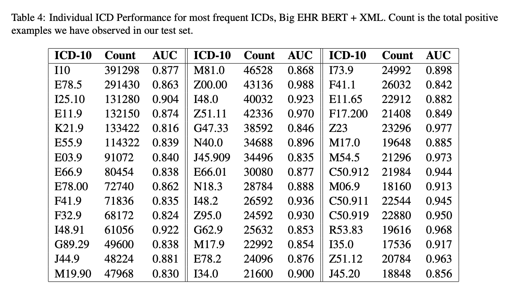

# BERT-XML: Large scale automated ICD coding using BERT pretraining
> [Zhang, Z., Liu, J., & Razavian, N. (2020). BERT-XML: Large scale automated ICD coding using BERT pretraining. arXiv preprint arXiv:2006.03685.](https://arxiv.org/pdf/2006.03685.pdf)
- ICD-10
- Customized BERT 
- Anonymous Institution EHR Data

## Motivations
Unlike many practitioners who use BERT models that have been already pretrained on a wide corpus, this work trained customized BERT models from scratch on EHR Notes to address the two major issues.
1. healthcare data contains a specific vocabulary, normal BERT leads to many out of vocabulary(OOV) words.
2. BERT only support sequence lengths up to 512, while EHR notes are sometimes longer than that. This work trained the model with 1024 sequence length instead.

## Datasets
Use de-identified medical notes and diagnoses in ICD-10 codes from the Anonymous Institution EHR system.  
The data contain a total of 7.5 million notes corresponding to visits from about 1 million patients. (million = 1,000,000 = 1M)  

Splits:
- Randomly split by patient into 70/10/20 train, dev, test sets

Preprocess on text:
- Exclude notes that are erroneously generated, student generated, belongs to miscellaneous category, as well as notes that contain fewer than 50 characters as these are often not diagnosis related
- Notes are padded to or split to chunks of a maximum length of 512 or 1,024, depending on the model
    - For notes that are split, the highest predicted probability per ICD code across chunks is used as the note level prediction

Preprocess on codes:
- Restrict the ICD codes for prediction to all codes that appear more than 1,000 times in the training set, resulting in 2,292 codes in total.
    - Each note contains 4.46 codes on average (training set).

## Methods
Multi-Label Attention:  
Multi-label attention output layer from AttentionXML (You et al.,2018) improves the performance (compared to normal BERT attention).  

Semantic Label Embedding:  
Randomly initialized multi-label attention takes long to start learning.  
Initialize via semantic label embeddings (Pappas and Henderson, 2019) with the BERT encoding of the plain text description of the associated ICD code is better. 

## Results

 

