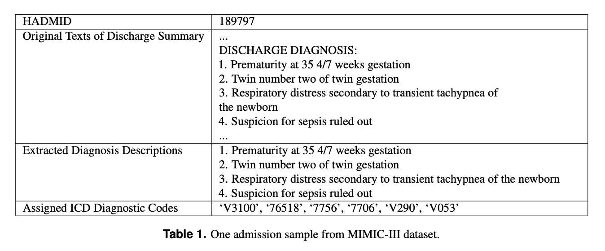
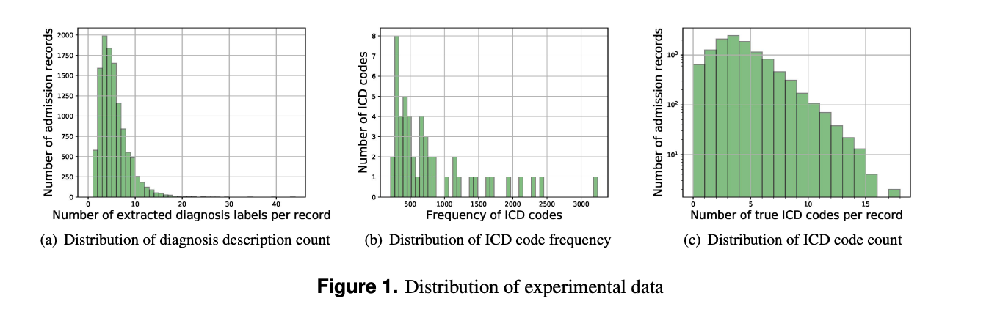

# Towards automated ICD coding using deep learning, 2017
> [Shi, H., Xie, P., Hu, Z., Zhang, M., & Xing, E. P. (2017). Towards automated ICD coding using deep learning. arXiv preprint arXiv:1711.04075.](https://arxiv.org/pdf/1711.04075.pdf)

MIMIC-III text samples:  

MIMIC-III code distributions:  

